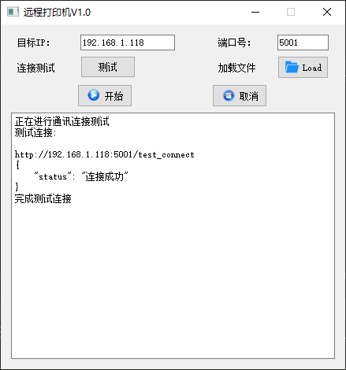

# 远程控制打印机

## 介绍
在同一局域网下，任何一台电脑都可以远程使用该打印机打印文件。  
### 思路  
1. 使用POST请求，远程把需要打印的文件传输到服务端。  
2. 在服务端完成该文件打印任务

## 软件架构
### 软件架构说明  
1. 使用PyQt5开发windows桌面软件；  
2. flask用于远程连接；  
3. win32print, win32api 控制打印机；  
### 开发语言  
1. python3

## 安装教程

1.  免安装，下载源码即可

## 使用说明

1.  printer_server.py ：服务端，运行在连接打印机的电脑上；
2.  printer_softward.py ：软件界面
3.  printer_client.py   ：客户端，在同一局域网下的电脑上，运行此代码。  
4.  界面如下图，填入连接打印机电脑的IP地址，端口号默认为5001。点击测试按钮，若返回状态为“连接成功”，即可加载文件进行打印。否侧请检查IP地址是否有误，是否在同一局域网内。  
  
    
## 作者  
A511实验室-MYY  
注：个人对Flask、控制打印机等方面了解不多，能力方面存有不足。  

  
  
## 现存问题  
1.  打印时未加入多线程模式，导致界面易处于假死状态。（尝试过加入多线程，发现无法执行打印任务）  
2.  多份文件同时打印时，有时候会出现只打印最后一份的情况。  

## 参与贡献
欢迎大家改善此代码  
承诺：此项目对于个人用户永久免费

